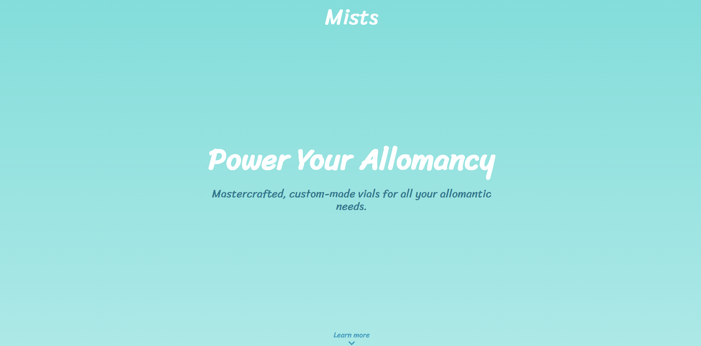

# Mists

> Landing page for a fictional business.

[//]: # (Screenshot, Application concept art etc)


[//]: # (Live Demo link)
<p align="center">
  <a href="https://tripoly-challenge.netlify.app/">Live Demo</a>
</p>
<p align="center">
  <a href="https://www.figma.com/community/file/888694273623743482/Tripoly-Design-Challenge">Figma Design</a>
</p>

## Built With

* React
* HTML
* CSS
* Figma
* Codesandbox

## Get Started

### Setup

1. Clone this repository.

```bash
git clone git@github.com:juzQrios/tripoly-challenge.git
```

2. Install dependencies.

```bash
npm install
```

3. Start local server.

```bash
npm start
```

4. Open <http://localhost:3000/> in a browser.


### Tests

While it is a good practice to test code, this project doesn't have any tests right now but I might add them in future.

### Deployment

You can easily deploy this React application using one of the several methods to [Netlify](https://www.netlify.com).

Easiest method being to deploy it from Git by clicking on the "[New site from Git](https://app.netlify.com/start)" button on Netlify dashboard.


## License

This project is [MIT](./LICENSE) licensed.

## Authors

#### Darshan

* GitHub: [@juzQrios](https://github.com/juzQrios)
* LinkedIn: [Darshan J](https://www.linkedin.com/in/jayadevdarshan/)
* Email: <dj30c.1@gmail.com>
